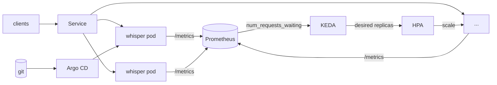
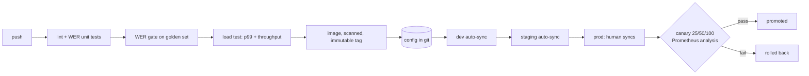

# whisper-serving

Speech-to-text serving stack. Whisper-Large on vLLM, autoscaled on Kubernetes by queue depth,
shipped through Argo CD with a word-error-rate gate in CI.


[](https://colab.research.google.com/github/riya0920/asr-serving-vllm-k8s/blob/main/notebooks/demo.ipynb)

Transcription traffic is bursty. Meeting load jumps ~8x on the hour and collapses after.
Provision for peak and you waste the day; provision for average and you drop requests. So the
fleet scales on a signal that moves before latency does, and deploys are cheap enough to do
often.

Numbers below are measured on rented A40, H100 NVL and A10 GPUs. Raw artifacts in `results/`.

---

## Demo

[**Run it in Colab**](https://colab.research.google.com/github/riya0920/asr-serving-vllm-k8s/blob/main/notebooks/demo.ipynb) — free T4, about 5 minutes. Builds a golden set from LibriSpeech, transcribes a clip,
scores it with the same WER code the CI gate uses, and measures the batching speedup.

Locally, start the server and transcribe a 30-second clip:

```console
$ vllm serve openai/whisper-large-v3-turbo --port 8000 --max-num-seqs 256
INFO  Route: /v1/audio/transcriptions, Methods: POST
INFO  Application startup complete.

$ curl -s -X POST localhost:8000/v1/audio/transcriptions \
    -F file=@golden/audio/clip_000.wav \
    -F model=openai/whisper-large-v3-turbo | jq -r .text

 Concord returned to its place amidst the tents. The English forwarded to the French
 baskets of flowers, of which they had made a plentiful provision to greet the arrival
 of the young princess. The French, in return, invited the English to a supper, which
 was to be given the next day.
```

The reference for that clip:

```
CONCORD RETURNED TO ITS PLACE AMIDST THE TENTS THE ENGLISH FORWARDED TO THE FRENCH
BASKETS OF FLOWERS OF WHICH THEY HAD MADE A PLENTIFUL PROVISION TO GREET THE ARRIVAL
OF THE YOUNG PRINCESS THE FRENCH IN RETURN INVITED THE ENGLISH TO A SUPPER WHICH WAS
TO BE GIVEN THE NEXT DAY
```

Same output from a pod on a GPU node:

```console
$ kubectl -n asr get pods -o wide
NAME                           READY   STATUS    IP           NODE
whisper-asr-684d6c7749-v74lj   1/1     Running   10.42.0.9    170-9-14-117

$ kubectl get nodes -o jsonpath='{.items[0].status.allocatable.nvidia\.com/gpu}'
1

$ curl -s http://10.42.0.9:8000/metrics | grep num_requests
vllm:num_requests_running{model_name="openai/whisper-large-v3-turbo"} 0.0
vllm:num_requests_waiting{model_name="openai/whisper-large-v3-turbo"} 0.0
```

That `num_requests_waiting` gauge is what the autoscaler watches.

---

## How it fits together



Requests hit a Service in front of N pods, each holding one GPU. Every pod publishes queue
depth. KEDA reads it from Prometheus and drives the HPA. Argo CD keeps the deployment matching
git.

---

## Performance

50 clips, exactly 30 seconds each, LibriSpeech test-clean, single GPU.

```
HF transformers, sequential   0.60 req/s   ▏                          1.0x
vLLM continuous batching      4.45 req/s   ██████▏                    7.4x
  + batch slots 32 → 256      7.36 req/s   ██████████▎               12.3x
  + large-v3-turbo           13.07 req/s   ██████████████████▎       21.8x
```

Latency and throughput pull against each other:

| concurrency | throughput | p50 | p99 |
|---|---|---|---|
| 1 | 2.79 req/s | 362 ms | **473 ms** |
| 2 | 3.90 req/s | 525 ms | 636 ms |
| 8 | 5.48 req/s | 1.4 s | 1.9 s |
| 128 | **13.07 req/s** | 8.5 s | 17 s |

Peak throughput lives at concurrency 128, where p99 is 17 seconds. Sub-500ms p99 lives at
concurrency 1, where throughput is 2.79 req/s. You get both by keeping each pod at low
concurrency and adding pods, which is the autoscaler's job.

Cost per audio hour drops 92% against the sequential baseline. Accuracy: 1.60% WER for
large-v3, 2.36% for turbo, reproduced to four decimals across three hosts.

---

## Autoscaling on queue depth

GPU utilization is a bad scaling signal. Once every batch slot is busy it reads ~100% whether
two requests are queued or two hundred, so it can't tell you how many pods to add. Queue depth
is unbounded and rises the moment arrivals outpace service.

An 8x step increase, measured:

```
  t     desired  ready
   0s      2       2    ██                  steady state, queue empty
  44s      2       2    ██                  spike arrives, queue starts filling
  46s      5       2    █████               scaled, one 2s sample later
  56s     10       5    ██████████
  66s     16      10    ████████████████    maxReplicas
  72s     16      16    ████████████████    fleet ready, queue drains
```

Queue depth peaked around 80 and fell to zero once the fleet caught up. Those samples came
from one pod through a round-robin Service, so individual readings bounce; the replica
progression above is the reliable part.

Three triggers, KEDA takes the max: in-flight requests hold steady-state occupancy near 70% so
a spike's first seconds land on warm pods, queue depth drives the surge, GPU utilization only
guards scale-down. Scale-up is immediate, scale-down waits 10 minutes. Dropping a pod 30
seconds before the next spike costs a full cold start.

---

## Shipping



The WER gate exists for one failure mode: a bad preprocessing config or truncated weight
download doesn't crash. The container starts, health checks pass, requests return 200 with
plausible English, and the transcripts are quietly worse. Without a gate, users notice first.

Measured: canary promotion 74s, automatic rollback 22s, commit to deployed about 90s.

---

## Where the ceiling is

Four experiments. Each would have shown clearly if the hypothesis held.

| # | hypothesis | result |
|---|---|---|
| 1 | A40 is GPU-bound | **confirmed** — 100% util at 300W, 4 clients gave 0.90x |
| 2 | a faster GPU goes faster | **wrong** — H100 hit 5.93 req/s vs A40's 13.07 |
| 3 | mel extraction on GPU unblocks it | **wrong** — CPU fell 23→16 cores, throughput +6% |
| 4 | a different engine is faster | **wrong** — faster-whisper 1.89 vs vLLM 10.72 |

The H100 result is the interesting one. A card with 3x the compute delivered less than half the
throughput, because Whisper's log-mel front end runs on CPU inside the engine process and
becomes the constraint once the GPU is fast enough.

Moving that work to the GPU confirmed it moved (CPU down 30%, GPU utilization doubled) and
bought 6%. Afterwards neither resource was saturated: 16 of 192 cores, GPU at 50% drawing 130W.
High utilization at low power means many small kernels with gaps, which points at a serialized
per-request path inside vLLM's encoder-decoder implementation.

Speculative decoding is half-done. vLLM 0.26 accepts encoder-decoder targets, but the
draft-model proposer assumes every multimodal model is a vision model and reads
`image_token_index` unconditionally. Patch in `patches/`. A second bug, draft input IDs never
populated on the encoder-decoder path, needs upstream work.

---

## Running it

```bash
# golden set + baseline (GPU)
python bench/build_golden.py --clips 50 --out golden
python bench/baseline_sequential.py --golden golden --out results/baseline.json

# serve + sweep concurrency
vllm serve openai/whisper-large-v3-turbo --port 8000 --max-num-seqs 256
python bench/loadgen.py --url http://localhost:8000 --audio-dir golden/audio \
  --profile sweep --concurrency-list 1,8,32,128 --out results/sweep.json

# 8x step-function spike
python bench/loadgen.py --url http://localhost:8000 --audio-dir golden/audio \
  --profile spike-8x --rps 4 --out results/spike.json

# cluster, no GPU needed
bash scripts/kind_up.sh
kubectl apply -f infra/keda/scaledobject.yaml
```

The load generator is open loop with Poisson arrivals, and clocks latency from *scheduled* send
time. A closed-loop generator throttles itself exactly when the server slows down, hiding the
overload you're trying to measure. It also fails its own run if the generator lagged more than
50ms, since past that the numbers describe the client.

`infra/stub/` is a fake engine exposing the same metrics and the same queueing behaviour, so
the autoscaling and delivery work can be built on a laptop instead of a rented GPU.

---

## Layout

```
bench/     load generator, WER scoring, baseline harness, engine servers
ci/        WER gate, perf gate, weight verification, manifest validator
infra/     k8s manifests, KEDA ScaledObject, Argo CD apps, Rollouts canary, stub engine
envs/      dev / staging / prod, reconciled by Argo CD
scripts/   cluster setup, environment probes, benchmark sessions
patches/   vLLM fix for audio multimodal speculative decoding
results/   raw run artifacts
docs/      decision records, including the experiments that failed
```

---

## Gotchas

Things that cost hours and aren't in any tutorial.

**Container GPU hosts can't run Kubernetes.** No `CAP_SYS_ADMIN`, read-only `ip_forward`, PID 1
isn't systemd. WSL2 works — it has systemd and cgroup v2.

**Ubuntu 26.04's WSL image has no iptables.** k3s logs that as informational, starts anyway,
then pod sandboxes churn forever and containers exit 255. Looks exactly like an app crash loop.

**CUDA 13 wheels vs 12.x drivers.** As of Aug 2026 the default PyPI wheels for torch and vLLM
both want CUDA 13, while plenty of rentable GPUs run 12.x drivers you can't upgrade. torch has
a pinnable cu128 index. vLLM doesn't.

**`vllm/vllm-openai` ships without audio deps.** The pod is healthy, the route is registered,
and every audio request returns 400 until librosa and soundfile are installed.

**`RollingUpdate` deadlocks on a single-GPU node.** The new pod waits for a GPU the old pod
holds. `kubectl get pods` shows Running the whole time. Use `Recreate`.

**k3s needs a `RuntimeClass` named `nvidia`** if the container toolkit was installed after k3s.
Otherwise the device plugin runs under runc and reports no GPUs at all.
